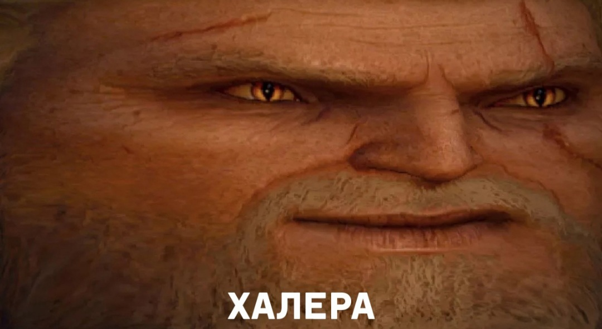

ФИО: Стукалкин Егор Олегович
группа: 6404-010302D
Научный руководитель: Гошин Егор Вячеславович
Тема диплома: Устранение шумов на изображенияx методом цепей маркова
Цитата: "Он слишком отличался от других чтобы выжить" - Геральт из Ривии.

Касаемо второй лабораторной работы, было реализовано 3 полноценные страницы: main, employee, sausages и одно модальное окно modal_history, которое в дальнейшем перейдёт в код main-page.

Цвета вынесены в отдельное файл ввиду цветового кретинизма автора, цвета-то он видит, но сочетать не умеет. Благодаря этому их легко будет настроить.

Все изображения, общие стили и шрифты тоже вынесены в отдельный файл. Многие изображения подписаны на русском языке ввиду специфики предметной области.

Лабораторная работа №4.
Пояснения: 
    Был реализован простой сервер с помощью фреймворка express для работы с запросами.
    Была добавлена красивая анимация на страницу modal_history_page
    Добавлена возможность отправки данных пользователем и получения данных с сервера с последующим отображением.
    Директория uploads хранит в себе изображения, которые пришли от пользователя.